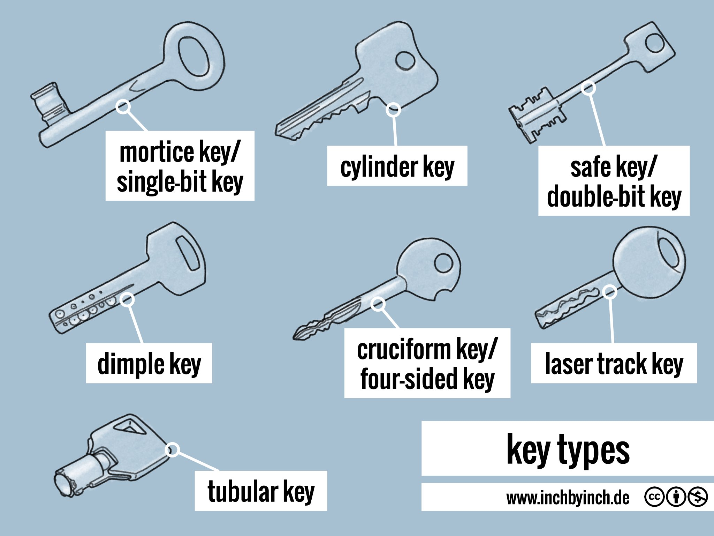

<P style="page-break-before: always">

<div align="justify" style="margin-right:25px;margin-left:25px">

# ARN - PW5 Object recognition in the wild using Convolutional Neural Networks

## Group information

- **Rodrigo LOPEZ DOS SANTOS**
- **Urs BEHRMANN**

# Introduction

We wanted to do a CNN model with objects which everyone has and thus not difficult to get a large dataset. We chose to do a model with keys. We looked up what different type of keys existed and found this graphic which shows the most common types of keys.



We don't have a particular use case for this model. We just wanted to see if we could make a model that could recognize the type of key.

We then asked our friends and family to send us pictures of their keys. We got a lot of pictures but not enough to make a train and a test set. We then decided to use the internet to get more pictures. 

Here are some examples of the pictures we got:


We will use transfer learning to train the model. We will use the MobileNetV2 as the base model and we will add a few layers on top of it.

<P style="page-break-before: always">

# The problem

We decided to only choose 4 types of keys to make the model easier to train. We chose the following keys:

- Cylinder key (Because their are the most common as house keys)
- Dimple key (Because they are also very common also as house keys)
- Laser track key (Because most car keys are laser track keys)
- Mortice key (Because they are very different from the other keys and their are often used for doors inside houses)

We got the following distribution of the keys:


We can see that the distribution of the keys is not equal. Mostly because we didn't get a lot of pictures of the dimple, laser track and mortice keys. That is why we decided to use the pictures we got from the internet to make the train dataset and we used the pictures we got from our friends and family to make the test dataset.

Keys are very similar to each other and it is difficult to differentiate them. The most difficult to differentiate are the dimple and the laser track keys. The cylinder and the mortice keys are easier to differentiate, because they don't have the same shape. Dimple and laser track keys have the same shape but the inside of the key is different.

<P style="page-break-before: always">

# Data preparation

We preprocessing the data to make it easier for the model to learn. We also used data augmentation to increase the size of the dataset. 

We used the following preprocessing:

- Resizing the images to 224x224
- Rescale the images to 1/255

We also used the following data augmentation:

- Random rotation
- Random zoom
- Random horizontal flip

**Before preprocessing**


**After preprocessing**


**After data augmentation**


We can see that the preprocessing makes the images easier to read and the features are more visible. We hope that the data augmentation will help the model to learn the features of the keys.

<P style="page-break-before: always">

# Model creation

describe how did you proceed to come up with a final model (model selection methodology, hyper-parameter exploration, cross-validation)

Because we use transfer learning we don't have to worry about the architecture of the base model. We only have to add a few layers on top of it. 

## hyperparameters 

| Hyperparameter            | Value |
| ------------------------- | ----- |
| Batch size                | 32    |
| Epochs                    | 10    |
| Optimizer                 | Adam  |
| Starting learning rate    | 1e-4  |
| Fine-tuning learning rate | 1e-5  |

## Architecture 

What is the architecture of your final model ? How many trainable parameters does it have? 

|                      |                     |
| -------------------- | ------------------: |
| Total params         | 2,340,228 (8.93 MB) |
| Trainable params     |  82,244 (321.27 KB) |
| Non-trainable params | 2,257,984 (8.61 MB) |

### Model summary

| Layer (type)                                    | Output Shape         | Param # |
| ----------------------------------------------- | -------------------- | ------- |
| input_layer_172                                 | (None, 224, 224, 3)  | 0       |
| Conv1 (Conv2D)                                  | (None, 112, 112, 32) | 864     |
| bn_Conv1 (BatchNormalization)                   | (None, 112, 112, 32) | 128     |
| Conv1_relu (ReLU)                               | (None, 112, 112, 32) | 0       |
| expanded_conv_depthwise                         | (None, 112, 112, 32) | 288     |
| expanded_conv_depthwise_BN (BatchNormalization) | (None, 112, 112, 32) | 128     |
| expanded_conv_depthwise_relu (ReLU)             | (None, 112, 112, 32) | 0       |
| expanded_conv_project                           | (None, 112, 112, 16) | 512     |
| expanded_conv_project_BN (BatchNormalization)   | (None, 112, 112, 16) | 64      |
| block_1_expand                                  | (None, 112, 112, 96) | 1536    |
| block_1_expand_BN                               | (None, 112, 112, 96) | 384     |
| block_1_expand_relu                             | (None, 112, 112, 96) | 0       |
| block_1_pad                                     | (None, 113, 113, 96) | 0       |
| block_1_depthwise                               | (None, 56, 56, 96)   | 864     |
| block_1_depthwise_BN                            | (None, 56, 56, 96)   | 384     |
| block_1_depthwise_relu                          | (None, 56, 56, 96)   | 0       |
| block_1_project                                 | (None, 56, 56, 24)   | 2304    |
| block_1_project_BN                              | (None, 56, 56, 24)   | 96      |
| block_2_expand                                  | (None, 56, 56, 144)  | 3456    |
| block_2_expand_BN                               | (None, 56, 56, 144)  | 576     |
| block_2_expand_relu                             | (None, 56, 56, 144)  | 0       |
| block_2_depthwise                               | (None, 56, 56, 144)  | 1296    |
| block_2_depthwise_BN                            | (None, 56, 56, 144)  | 576     |
| block_2_depthwise_relu                          | (None, 56, 56, 144)  | 0       |
| block_2_project                                 | (None, 56, 56, 24)   | 3456    |
| block_2_project_BN                              | (None, 56, 56, 24)   | 96      |
| block_2_add (Add)                               | (None, 56, 56, 24)   | 0       |
| block_3_expand                                  | (None, 56, 56, 144)  | 3456    |
| block_3_expand_BN                               | (None, 56, 56, 144)  | 576     |
| block_3_expand_relu                             | (None, 56, 56, 144)  | 0       |
| block_3_pad                                     | (None, 57, 57, 144)  | 0       |
| block_3_depthwise                               | (None, 28, 28, 144)  | 1296    |
| block_3_depthwise_BN                            | (None, 28, 28, 144)  | 576     |
| block_3_depthwise_relu                          | (None, 28, 28, 144)  | 0       |
| block_3_project                                 | (None, 28, 28, 32)   | 4608    |
| block_3_project_BN                              | (None, 28, 28, 32)   | 128     |
| block_4_expand                                  | (None, 28, 28, 192)  | 6144    |
| block_4_expand_BN                               | (None, 28, 28, 192)  | 768     |
| block_4_expand_relu                             | (None, 28, 28, 192)  | 0       |
| block_4_depthwise                               | (None, 28, 28, 192)  | 1728    |
| block_4_depthwise_BN                            | (None, 28, 28, 192)  | 768     |
| block_4_depthwise_relu                          | (None, 28, 28, 192)  | 0       |
| block_4_project                                 | (None, 28, 28, 32)   | 6144    |
| block_4_project_BN                              | (None, 28, 28, 32)   | 128     |
| block_4_add (Add)                               | (None, 28, 28, 32)   | 0       |
| block_5_expand                                  | (None, 28, 28, 192)  | 6144    |
| block_5_expand_BN                               | (None, 28, 28, 192)  | 768     |
| block_5_expand_relu                             | (None, 28, 28, 192)  | 0       |
| block_5_depthwise                               | (None, 28, 28, 192)  | 1728    |
| block_5_depthwise_BN                            | (None, 28, 28, 192)  | 768     |
| block_5_depthwise_relu                          | (None, 28, 28, 192)  | 0       |
| block_5_project                                 | (None, 28, 28, 32)   | 6144    |
| block_5_project_BN                              | (None, 28, 28, 32)   | 128     |
| block_5_add (Add)                               | (None, 28, 28, 32)   | 0       |
| block_6_expand                                  | (None, 28, 28, 192)  | 6144    |
| block_6_expand_BN                               | (None, 28, 28, 192)  | 768     |
| block_6_expand_relu                             | (None, 28, 28, 192)  | 0       |
| block_6_pad                                     | (None, 29, 29, 192)  | 0       |
| block_6_depthwise                               | (None, 14, 14, 192)  | 1728    |
| block_6_depthwise_BN                            | (None, 14, 14, 192)  | 768     |
| block_6_depthwise_relu                          | (None, 14, 14, 192)  | 0       |
| block_6_project                                 | (None, 14, 14, 64)   | 12288   |
| block_6_project_BN                              | (None, 14, 14, 64)   | 256     |
| block_7_expand                                  | (None, 14, 14, 384)  | 24576   |
| block_7_expand_BN                               | (None, 14, 14, 384)  | 1536    |
| block_7_expand_relu                             | (None, 14, 14, 384)  | 0       |
| block_7_depthwise                               | (None, 14, 14, 384)  | 3456    |
| block_7_depthwise_BN                            | (None, 14, 14, 384)  | 1536    |
| block_7_depthwise_relu                          | (None, 14, 14, 384)  | 0       |
| block_7_project                                 | (None, 14, 14, 64)   | 24576   |
| block_7_project_BN                              | (None, 14, 14, 64)   | 256     |
| block_7_add (Add)                               | (None, 14, 14, 64)   | 0       |
| block_8_expand                                  | (None, 14, 14, 384)  | 24576   |
| block_8_expand_BN                               | (None, 14, 14, 384)  | 1536    |
| block_8_expand_relu                             | (None, 14, 14, 384)  | 0       |
| block_8_depthwise                               | (None, 14, 14, 384)  | 3456    |
| block_8_depthwise_BN                            | (None, 14, 14, 384)  | 1536    |
| block_8_depthwise_relu                          | (None, 14, 14, 384)  | 0       |
| block_8_project                                 | (None, 14, 14, 64)   | 24576   |
| block_8_project_BN                              | (None, 14, 14, 64)   | 256     |
| block_8_add (Add)                               | (None, 14, 14, 64)   | 0       |
| block_9_expand                                  | (None, 14, 14, 384)  | 24576   |
| block_9_expand_BN                               | (None, 14, 14, 384)  | 1536    |
| block_9_expand_relu                             | (None, 14, 14, 384)  | 0       |
| block_9_depthwise                               | (None, 14, 14, 384)  | 3456    |
| block_9_depthwise_BN                            | (None, 14, 14, 384)  | 1536    |
| block_9_depthwise_relu                          | (None, 14, 14, 384)  | 0       |
| block_9_project                                 | (None, 14, 14, 64)   | 24576   |
| block_9_project_BN                              | (None, 14, 14, 64)   | 256     |
| block_9_add (Add)                               | (None, 14, 14, 64)   | 0       |
| block_10_expand                                 | (None, 14, 14, 384)  | 24576   |
| block_10_expand_BN                              | (None, 14, 14, 384)  | 1536    |
| block_10_expand_relu                            | (None, 14, 14, 384)  | 0       |
| block_10_depthwise                              | (None, 14, 14, 384)  | 3456    |
| block_10_depthwise_BN                           | (None, 14, 14, 384)  | 1536    |
| block_10_depthwise_relu                         | (None, 14, 14, 384)  | 0       |
| block_10_project                                | (None, 14, 14, 96)   | 36864   |
| block_10_project_BN                             | (None, 14, 14, 96)   | 384     |
| block_11_expand                                 | (None, 14, 14, 576)  | 55296   |
| block_11_expand_BN                              | (None, 14, 14, 576)  | 2304    |
| block_11_expand_relu                            | (None, 14, 14, 576)  | 0       |
| block_11_depthwise                              | (None, 14, 14, 576)  | 5184    |
| block_11_depthwise_BN                           | (None, 14, 14, 576)  | 2304    |
| block_11_depthwise_relu                         | (None, 14, 14, 576)  | 0       |
| block_11_project                                | (None, 14, 14, 96)   | 55296   |
| block_11_project_BN                             | (None, 14, 14, 96)   | 384     |
| block_11_add (Add)                              | (None, 14, 14, 96)   | 0       |
| block_12_expand                                 | (None, 14, 14, 576)  | 55296   |
| block_12_expand_BN                              | (None, 14, 14, 576)  | 2304    |
| block_12_expand_relu                            | (None, 14, 14, 576)  | 0       |
| block_12_depthwise                              | (None, 14, 14, 576)  | 5184    |
| block_12_depthwise_BN                           | (None, 14, 14, 576)  | 2304    |
| block_12_depthwise_relu                         | (None, 14, 14, 576)  | 0       |
| block_12_project                                | (None, 14, 14, 96)   | 55296   |
| block_12_project_BN                             | (None, 14, 14, 96)   | 384     |
| block_12_add (Add)                              | (None, 14, 14, 96)   | 0       |
| block_13_expand                                 | (None, 14, 14, 576)  | 55296   |
| block_13_expand_BN                              | (None, 14, 14, 576)  | 2304    |
| block_13_expand_relu                            | (None, 14, 14, 576)  | 0       |
| block_13_pad                                    | (None, 15, 15, 576)  | 0       |
| block_13_depthwise                              | (None, 7, 7, 576)    | 5184    |
| block_13_depthwise_BN                           | (None, 7, 7, 576)    | 2304    |
| block_13_depthwise_relu                         | (None, 7, 7, 576)    | 0       |
| block_13_project                                | (None, 7, 7, 160)    | 92160   |
| block_13_project_BN                             | (None, 7, 7, 160)    | 640     |
| block_14_expand                                 | (None, 7, 7, 960)    | 153600  |
| block_14_expand_BN                              | (None, 7, 7, 960)    | 3840    |
| block_14_expand_relu                            | (None, 7, 7, 960)    | 0       | 
| block_14_depthwise                              | (None, 7, 7, 960)    | 8640    | 
| block_14_depthwise_BN                           | (None, 7, 7, 960)    | 3840    | 
| block_14_depthwise_relu                         | (None, 7, 7, 960)    | 0       | 
| block_14_project                                | (None, 7, 7, 160)    | 153600  | 
| block_14_project_BN                             | (None, 7, 7, 160)    | 640     | 
| block_14_add (Add)                              | (None, 7, 7, 160)    | 0       | 
| block_15_expand                                 | (None, 7, 7, 960)    | 153600  | 
| block_15_expand_BN                              | (None, 7, 7, 960)    | 3840    | 
| block_15_expand_relu                            | (None, 7, 7, 960)    | 0       | 
| block_15_depthwise                              | (None, 7, 7, 960)    | 8640    | 
| block_15_depthwise_BN                           | (None, 7, 7, 960)    | 3840    | 
| block_15_depthwise_relu                         | (None, 7, 7, 960)    | 0       | 
| block_15_project                                | (None, 7, 7, 160)    | 153600  | 
| block_15_project_BN                             | (None, 7, 7, 160)    | 640     | 
| block_15_add (Add)                              | (None, 7, 7, 160)    | 0       | 
| block_16_expand                                 | (None, 7, 7, 960)    | 153600  | 
| block_16_expand_BN                              | (None, 7, 7, 960)    | 3840    | 
| block_16_expand_relu                            | (None, 7, 7, 960)    | 0       | 
| block_16_depthwise                              | (None, 7, 7, 960)    | 8640    | 
| block_16_depthwise_BN                           | (None, 7, 7, 960)    | 3840    | 
| block_16_depthwise_relu                         | (None, 7, 7, 960)    | 0       | 
| block_16_project                                | (None, 7, 7, 320)    | 307200  | 
| block_16_project_BN                             | (None, 7, 7, 320)    | 1280    | 
| Conv_1 (Conv2D)                                 | (None, 7, 7, 1280)   | 409600  | 
| Conv_1_bn (BatchNormalization)                  | (None, 7, 7, 1280)   | 5120    | 
| out_relu (ReLU)                                 | (None, 7, 7, 1280)   | 0       | 
| sequential_130 (Sequential)                     | (None, 4)            | 82244   | 


## Transfer learning

We used transfer learning because we didn't have enough data to train the model from scratch. We froze the base model. We then added our layers on top of the base model.

Then we unfroze a few layers of the base model, changed the learning rate of the optimizer and trained the whole model. This way we could fine tune the features the base model learned and optimize the recognition of the keys.

```python	
model = get_model() # We reinitialize the model

history = model.fit(
    x=augmented_train_images,
    y=train_labels,
    batch_size=32,
    validation_data=[val_images, val_labels],
    epochs=NB_EPOCHS,
)

# Fine-tune the model
for layer in model.layers[-20:]:  # Unfreeze the last20 layers
    layer.trainable = True

model.compile(
    optimizer=Adam(learning_rate=1e-5),  # Lower learning rate for fine-tuning
    loss=SparseCategoricalCrossentropy(),
    metrics=['accuracy']
)

# Continue training
fine_tune_history = model.fit(
    x=augmented_train_images,
    y=train_labels,
    batch_size=32,
    validation_data=[val_images, val_labels],
    epochs=NB_EPOCHS,
)
```

<P style="page-break-before: always">

# Results

describe the experiments you performed with the model both off-line (running in your notebooks with your own-collected images) and on-line (running in the smartphone and processing images captured in the “wild”). 

a. Provide your plots and confusion matrices 

b. Provide the f-score you obtain for each of your classes. 

c. Provide the results you have after evaluating your model on the test set. Comment if the performance on the test set is close to the validation performance. What about the performance of the system in the real world ? 

d. Present an analysis of the relevance of the trained system using the Class Activation Map methods (grad-cam) 

e. Provide some of your misclassified images (test set and real-world tests) and comment those errors. 

f. Based on your results how could you improve your dataset ?  

g. Observe which classes are confused. Does it surprise you? In your opinion, what can cause those confusions ?  What happens when you use your embedded system to recognize objects that don’t belong to any classes in your dataset ? How does your system work if your object is placed in a different background ?

# Conclusion

finalize your report with some conclusions, summarize your results, mention the limits of your system and potential future work

</div>