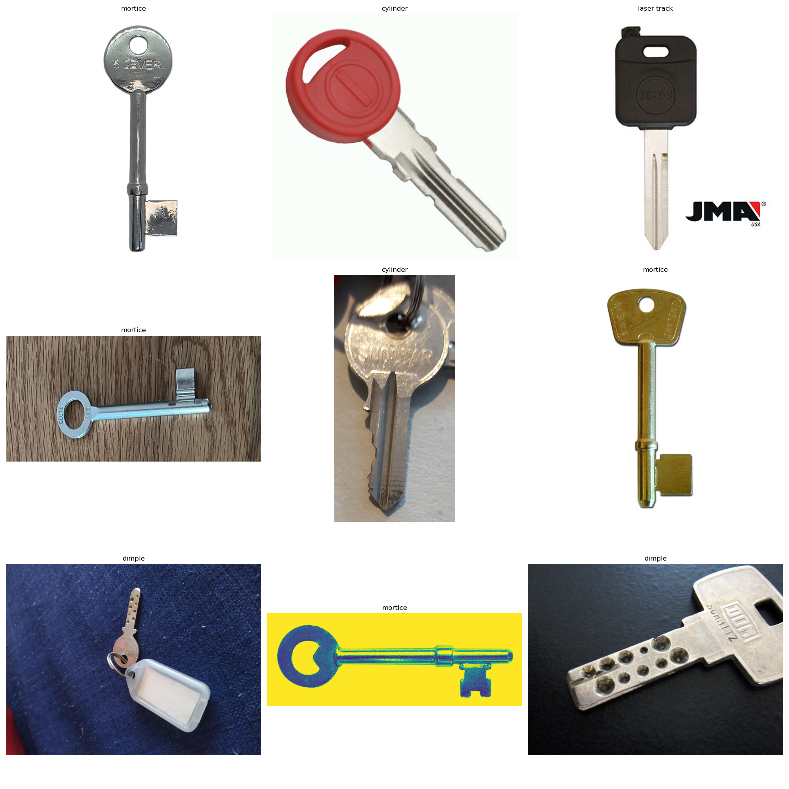
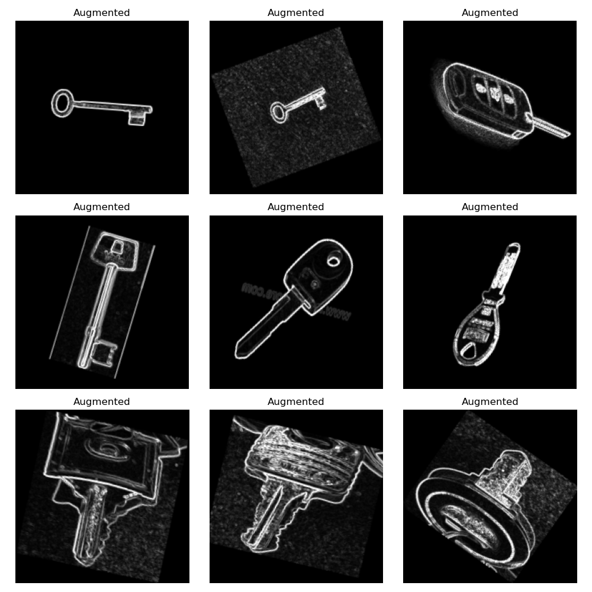
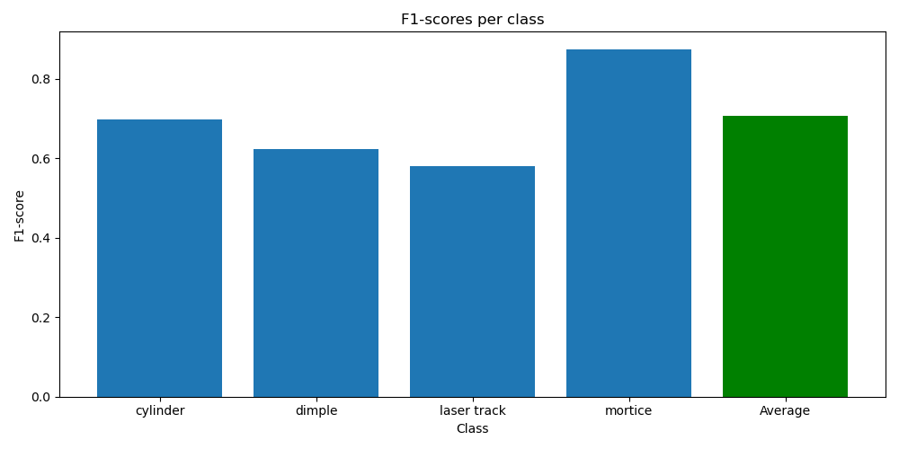
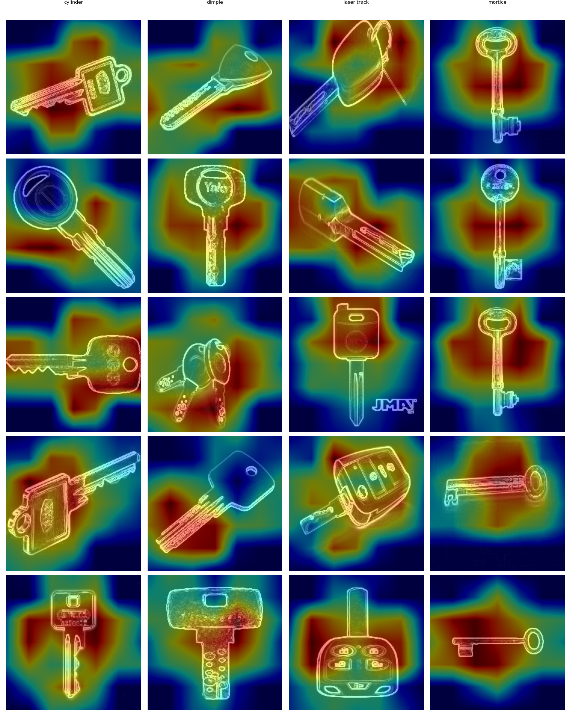
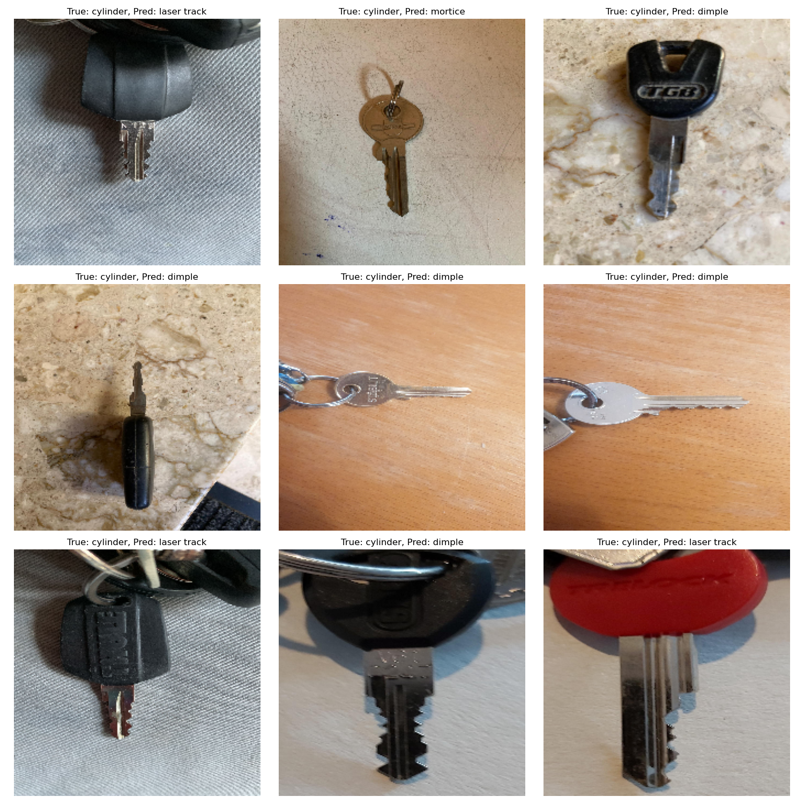

<P style="page-break-before: always">

<div align="justify" style="margin-right:25px;margin-left:25px">

# ARN - PW5 Object recognition in the wild using Convolutional Neural Networks

## Group information

- **Rodrigo LOPEZ DOS SANTOS**
- **Urs BEHRMANN**

# Introduction

We aimed to create a CNN model using objects that are common and easily accessible, making it feasible to gather a large dataset. We decided to build a model with keys. After researching the different types of keys, we found a graphic illustrating the most common types.


We don't have a specific use case for this model; our goal was simply to see if we could create a model capable of recognizing different types of keys.

To gather data, we asked our friends and family to send us pictures of their keys. Additionally, we planned to supplement our dataset with images from the internet to either enlarge or balance the dataset, especially if we didn't receive enough images of a particular key type.

Here are some examples of the pictures we collected:



We will use transfer learning with MobileNetV2 as the base model, adding a few custom layers on top of it.

To enhance model learning, we will preprocess the data and employ data augmentation techniques to increase the size and diversity of the dataset.

<P style="page-break-before: always">

# The problem

We decided to focus on only 4 types of keys to make the model easier to train. We chose the following keys:

- Cylinder key (because they are the most common as house keys)
- Dimple key (because they are also very common as house keys)
- Laser track key (because most car keys are laser track keys)
- Mortice key (because they are very different from the other keys and are often used for doors inside houses)

We obtained the following distribution of the keys:


We can see that the distribution of the keys is not equal, primarily because we didn't get many pictures of dimple, laser track, and mortice keys. To address this, we decided to use the pictures we obtained from the internet to create the training dataset, and the pictures we collected from our friends and family to create the test dataset.

Keys are very similar to each other, making it difficult to differentiate them. The most challenging to differentiate are the dimple and laser track keys. In contrast, cylinder and mortice keys are easier to differentiate because they have distinct shapes. Dimple and laser track keys share the same shape, but their internal features are different.

<P style="page-break-before: always">

# Data preparation

We preprocessed the data to make it easier for the model to learn. Additionally, we used data augmentation to increase the size of the dataset. After some testing, we incorporated edge detection into the preprocessing to make the features of the keys more visible.

## Preprocessing

We used the following preprocessing steps:

- Resizing the images to 224x224
- Rescaling the images by 1/255

The resizing is necessary because the input layer of the model we are building only accepts images of size 224x224. We do not crop to aspect ratio because we want to retain all the features of the keys without cutting them off.

### Example of preprocessing


A lot of pictures became wider due to resizing. We hope that the model will still be able to learn the features of the keys despite this change, as the test set will also undergo the same preprocessing.

<P style="page-break-before: always">

## Edge detection

We chose to add edge detection preprocessing to help the CNN better extract features that depend on the contours of the keys. The edge detection will make the edges of the keys white and the rest of the image black. We used the following code to perform the edge detection:

```python
def edge_detection(image):
    # Convert to grayscale
    gray = tf.image.rgb_to_grayscale(image)
    gray = tf.expand_dims(gray, axis=0)  # Add batch dimension
    
    # Apply Sobel edge detection
    edges = tf.image.sobel_edges(gray)
    edges = tf.sqrt(tf.reduce_sum(tf.square(edges), axis=-1))
    edges = tf.clip_by_value(
        edges,
        clip_value_min=0,
        clip_value_max=1
    )

    # Convert back to RGB
    edges = tf.squeeze(edges, axis=0)  # Remove channel dimension
    edges = tf.image.grayscale_to_rgb(edges)  # Convert to RGB

    return edges
```
### Explanation of the code

We begin by converting the input image to a grayscale image, then add a batch dimension to the grayscale image to make it compatible with TensorFlow operations. Next, Sobel edge detection is applied to identify the edges in the grayscale image. The magnitude of these edges is then calculated and clipped to ensure the values are within the range of 0 to 1. After processing, the resulting edge-detected image, which is still in grayscale, is converted back to an RGB image. Finally, the code returns this edge-detected RGB image.

### Example of edge detection


We can see that the features of the keys are more visible with the edge detection preprocessing. However, some details of the keys are also lost. Additionally, the background of the images introduces noise in the edge detection preprocessing.

## Data augmentation

We also applied the following data augmentation techniques:

- Random rotation
- Random zoom
- Random horizontal flip

We chose not to use a specific seed for these augmentations. Additionally, we changed the fill color of the images to black when they are rotated or zoomed out. We chose black because the edge detection preprocessor transforms most of the image to black and keeps only the edges white.

### Example of data augmentation



We can see that the data augmentation is working effectively. The images are being rotated, zoomed, and flipped. The features of the keys remain visible, and not many details are lost. The fill areas are noticeable only in images with a non-monochrome background.

<P style="page-break-before: always">

# Model creation

Because we use transfer learning, we don't have to worry about the architecture of the base model. We only need to add a few layers on top of it.

We added the following layers:

- A global average pooling layer
- A dense layer with 254 units and a ReLU activation function
- A dropout layer with a dropout rate of 0.3
- A dense layer with 4 units and a softmax activation function

The last layer is the output layer. It has 4 units because we have 4 classes. The softmax activation function is used because we have a multi-class classification problem.

We used the RMSprop optimizer because it is well-suited for transfer learning. We used the sparse categorical crossentropy loss function because we have a multi-class classification problem.

Additionally, we used k-fold cross-validation to evaluate the model, opting for 3 folds due to our limited data.

We also added an early stopping callback to halt the training if the validation loss doesn't decrease for 3 epochs.

## Summary of hyperparameters 

| Hyperparameter | Value                         |
| -------------- | ----------------------------- |
| Batch size     | 32                            |
| Epochs         | 10                            |
| Optimizer      | RMSprop                       |
| Learning rate  | 1e-4                          |
| Kfold          | 3                             |
| Loss function  | SparseCategoricalCrossentropy |

## Architecture 


### Parameters

|                      |                     |
| -------------------- | ------------------: |
| Total params         | 2,340,228 (8.93 MB) |
| Trainable params     |  82,244 (321.27 KB) |
| Non-trainable params | 2,257,984 (8.61 MB) |

### Model summary

| Layer (type)                                    | Output Shape         | Param # |
| ----------------------------------------------- | -------------------- | ------- |
| input_layer_172                                 | (None, 224, 224, 3)  | 0       |
| Conv1 (Conv2D)                                  | (None, 112, 112, 32) | 864     |
| bn_Conv1 (BatchNormalization)                   | (None, 112, 112, 32) | 128     |
| Conv1_relu (ReLU)                               | (None, 112, 112, 32) | 0       |
| expanded_conv_depthwise                         | (None, 112, 112, 32) | 288     |
| expanded_conv_depthwise_BN (BatchNormalization) | (None, 112, 112, 32) | 128     |
| expanded_conv_depthwise_relu (ReLU)             | (None, 112, 112, 32) | 0       |
| expanded_conv_project                           | (None, 112, 112, 16) | 512     |
| expanded_conv_project_BN (BatchNormalization)   | (None, 112, 112, 16) | 64      |
| block_1_expand                                  | (None, 112, 112, 96) | 1536    |
| block_1_expand_BN                               | (None, 112, 112, 96) | 384     |
| block_1_expand_relu                             | (None, 112, 112, 96) | 0       |
| block_1_pad                                     | (None, 113, 113, 96) | 0       |
| block_1_depthwise                               | (None, 56, 56, 96)   | 864     |
| block_1_depthwise_BN                            | (None, 56, 56, 96)   | 384     |
| block_1_depthwise_relu                          | (None, 56, 56, 96)   | 0       |
| block_1_project                                 | (None, 56, 56, 24)   | 2304    |
| block_1_project_BN                              | (None, 56, 56, 24)   | 96      |
| block_2_expand                                  | (None, 56, 56, 144)  | 3456    |
| block_2_expand_BN                               | (None, 56, 56, 144)  | 576     |
| block_2_expand_relu                             | (None, 56, 56, 144)  | 0       |
| block_2_depthwise                               | (None, 56, 56, 144)  | 1296    |
| block_2_depthwise_BN                            | (None, 56, 56, 144)  | 576     |
| block_2_depthwise_relu                          | (None, 56, 56, 144)  | 0       |
| block_2_project                                 | (None, 56, 56, 24)   | 3456    |
| block_2_project_BN                              | (None, 56, 56, 24)   | 96      |
| block_2_add (Add)                               | (None, 56, 56, 24)   | 0       |
| block_3_expand                                  | (None, 56, 56, 144)  | 3456    |
| block_3_expand_BN                               | (None, 56, 56, 144)  | 576     |
| block_3_expand_relu                             | (None, 56, 56, 144)  | 0       |
| block_3_pad                                     | (None, 57, 57, 144)  | 0       |
| block_3_depthwise                               | (None, 28, 28, 144)  | 1296    |
| block_3_depthwise_BN                            | (None, 28, 28, 144)  | 576     |
| block_3_depthwise_relu                          | (None, 28, 28, 144)  | 0       |
| block_3_project                                 | (None, 28, 28, 32)   | 4608    |
| block_3_project_BN                              | (None, 28, 28, 32)   | 128     |
| block_4_expand                                  | (None, 28, 28, 192)  | 6144    |
| block_4_expand_BN                               | (None, 28, 28, 192)  | 768     |
| block_4_expand_relu                             | (None, 28, 28, 192)  | 0       |
| block_4_depthwise                               | (None, 28, 28, 192)  | 1728    |
| block_4_depthwise_BN                            | (None, 28, 28, 192)  | 768     |
| block_4_depthwise_relu                          | (None, 28, 28, 192)  | 0       |
| block_4_project                                 | (None, 28, 28, 32)   | 6144    |
| block_4_project_BN                              | (None, 28, 28, 32)   | 128     |
| block_4_add (Add)                               | (None, 28, 28, 32)   | 0       |
| block_5_expand                                  | (None, 28, 28, 192)  | 6144    |
| block_5_expand_BN                               | (None, 28, 28, 192)  | 768     |
| block_5_expand_relu                             | (None, 28, 28, 192)  | 0       |
| block_5_depthwise                               | (None, 28, 28, 192)  | 1728    |
| block_5_depthwise_BN                            | (None, 28, 28, 192)  | 768     |
| block_5_depthwise_relu                          | (None, 28, 28, 192)  | 0       |
| block_5_project                                 | (None, 28, 28, 32)   | 6144    |
| block_5_project_BN                              | (None, 28, 28, 32)   | 128     |
| block_5_add (Add)                               | (None, 28, 28, 32)   | 0       |
| block_6_expand                                  | (None, 28, 28, 192)  | 6144    |
| block_6_expand_BN                               | (None, 28, 28, 192)  | 768     |
| block_6_expand_relu                             | (None, 28, 28, 192)  | 0       |
| block_6_pad                                     | (None, 29, 29, 192)  | 0       |
| block_6_depthwise                               | (None, 14, 14, 192)  | 1728    |
| block_6_depthwise_BN                            | (None, 14, 14, 192)  | 768     |
| block_6_depthwise_relu                          | (None, 14, 14, 192)  | 0       |
| block_6_project                                 | (None, 14, 14, 64)   | 12288   |
| block_6_project_BN                              | (None, 14, 14, 64)   | 256     |
| block_7_expand                                  | (None, 14, 14, 384)  | 24576   |
| block_7_expand_BN                               | (None, 14, 14, 384)  | 1536    |
| block_7_expand_relu                             | (None, 14, 14, 384)  | 0       |
| block_7_depthwise                               | (None, 14, 14, 384)  | 3456    |
| block_7_depthwise_BN                            | (None, 14, 14, 384)  | 1536    |
| block_7_depthwise_relu                          | (None, 14, 14, 384)  | 0       |
| block_7_project                                 | (None, 14, 14, 64)   | 24576   |
| block_7_project_BN                              | (None, 14, 14, 64)   | 256     |
| block_7_add (Add)                               | (None, 14, 14, 64)   | 0       |
| block_8_expand                                  | (None, 14, 14, 384)  | 24576   |
| block_8_expand_BN                               | (None, 14, 14, 384)  | 1536    |
| block_8_expand_relu                             | (None, 14, 14, 384)  | 0       |
| block_8_depthwise                               | (None, 14, 14, 384)  | 3456    |
| block_8_depthwise_BN                            | (None, 14, 14, 384)  | 1536    |
| block_8_depthwise_relu                          | (None, 14, 14, 384)  | 0       |
| block_8_project                                 | (None, 14, 14, 64)   | 24576   |
| block_8_project_BN                              | (None, 14, 14, 64)   | 256     |
| block_8_add (Add)                               | (None, 14, 14, 64)   | 0       |
| block_9_expand                                  | (None, 14, 14, 384)  | 24576   |
| block_9_expand_BN                               | (None, 14, 14, 384)  | 1536    |
| block_9_expand_relu                             | (None, 14, 14, 384)  | 0       |
| block_9_depthwise                               | (None, 14, 14, 384)  | 3456    |
| block_9_depthwise_BN                            | (None, 14, 14, 384)  | 1536    |
| block_9_depthwise_relu                          | (None, 14, 14, 384)  | 0       |
| block_9_project                                 | (None, 14, 14, 64)   | 24576   |
| block_9_project_BN                              | (None, 14, 14, 64)   | 256     |
| block_9_add (Add)                               | (None, 14, 14, 64)   | 0       |
| block_10_expand                                 | (None, 14, 14, 384)  | 24576   |
| block_10_expand_BN                              | (None, 14, 14, 384)  | 1536    |
| block_10_expand_relu                            | (None, 14, 14, 384)  | 0       |
| block_10_depthwise                              | (None, 14, 14, 384)  | 3456    |
| block_10_depthwise_BN                           | (None, 14, 14, 384)  | 1536    |
| block_10_depthwise_relu                         | (None, 14, 14, 384)  | 0       |
| block_10_project                                | (None, 14, 14, 96)   | 36864   |
| block_10_project_BN                             | (None, 14, 14, 96)   | 384     |
| block_11_expand                                 | (None, 14, 14, 576)  | 55296   |
| block_11_expand_BN                              | (None, 14, 14, 576)  | 2304    |
| block_11_expand_relu                            | (None, 14, 14, 576)  | 0       |
| block_11_depthwise                              | (None, 14, 14, 576)  | 5184    |
| block_11_depthwise_BN                           | (None, 14, 14, 576)  | 2304    |
| block_11_depthwise_relu                         | (None, 14, 14, 576)  | 0       |
| block_11_project                                | (None, 14, 14, 96)   | 55296   |
| block_11_project_BN                             | (None, 14, 14, 96)   | 384     |
| block_11_add (Add)                              | (None, 14, 14, 96)   | 0       |
| block_12_expand                                 | (None, 14, 14, 576)  | 55296   |
| block_12_expand_BN                              | (None, 14, 14, 576)  | 2304    |
| block_12_expand_relu                            | (None, 14, 14, 576)  | 0       |
| block_12_depthwise                              | (None, 14, 14, 576)  | 5184    |
| block_12_depthwise_BN                           | (None, 14, 14, 576)  | 2304    |
| block_12_depthwise_relu                         | (None, 14, 14, 576)  | 0       |
| block_12_project                                | (None, 14, 14, 96)   | 55296   |
| block_12_project_BN                             | (None, 14, 14, 96)   | 384     |
| block_12_add (Add)                              | (None, 14, 14, 96)   | 0       |
| block_13_expand                                 | (None, 14, 14, 576)  | 55296   |
| block_13_expand_BN                              | (None, 14, 14, 576)  | 2304    |
| block_13_expand_relu                            | (None, 14, 14, 576)  | 0       |
| block_13_pad                                    | (None, 15, 15, 576)  | 0       |
| block_13_depthwise                              | (None, 7, 7, 576)    | 5184    |
| block_13_depthwise_BN                           | (None, 7, 7, 576)    | 2304    |
| block_13_depthwise_relu                         | (None, 7, 7, 576)    | 0       |
| block_13_project                                | (None, 7, 7, 160)    | 92160   |
| block_13_project_BN                             | (None, 7, 7, 160)    | 640     |
| block_14_expand                                 | (None, 7, 7, 960)    | 153600  |
| block_14_expand_BN                              | (None, 7, 7, 960)    | 3840    |
| block_14_expand_relu                            | (None, 7, 7, 960)    | 0       |
| block_14_depthwise                              | (None, 7, 7, 960)    | 8640    |
| block_14_depthwise_BN                           | (None, 7, 7, 960)    | 3840    |
| block_14_depthwise_relu                         | (None, 7, 7, 960)    | 0       |
| block_14_project                                | (None, 7, 7, 160)    | 153600  |
| block_14_project_BN                             | (None, 7, 7, 160)    | 640     |
| block_14_add (Add)                              | (None, 7, 7, 160)    | 0       |
| block_15_expand                                 | (None, 7, 7, 960)    | 153600  |
| block_15_expand_BN                              | (None, 7, 7, 960)    | 3840    |
| block_15_expand_relu                            | (None, 7, 7, 960)    | 0       |
| block_15_depthwise                              | (None, 7, 7, 960)    | 8640    |
| block_15_depthwise_BN                           | (None, 7, 7, 960)    | 3840    |
| block_15_depthwise_relu                         | (None, 7, 7, 960)    | 0       |
| block_15_project                                | (None, 7, 7, 160)    | 153600  |
| block_15_project_BN                             | (None, 7, 7, 160)    | 640     |
| block_15_add (Add)                              | (None, 7, 7, 160)    | 0       |
| block_16_expand                                 | (None, 7, 7, 960)    | 153600  |
| block_16_expand_BN                              | (None, 7, 7, 960)    | 3840    |
| block_16_expand_relu                            | (None, 7, 7, 960)    | 0       |
| block_16_depthwise                              | (None, 7, 7, 960)    | 8640    |
| block_16_depthwise_BN                           | (None, 7, 7, 960)    | 3840    |
| block_16_depthwise_relu                         | (None, 7, 7, 960)    | 0       |
| block_16_project                                | (None, 7, 7, 320)    | 307200  |
| block_16_project_BN                             | (None, 7, 7, 320)    | 1280    |
| Conv_1 (Conv2D)                                 | (None, 7, 7, 1280)   | 409600  |
| Conv_1_bn (BatchNormalization)                  | (None, 7, 7, 1280)   | 5120    |
| out_relu (ReLU)                                 | (None, 7, 7, 1280)   | 0       |
| sequential_130 (Sequential)                     | (None, 4)            | 82244   |

<P style="page-break-before: always">

## Transfer learning

We used transfer learning because we didn't have enough data to train the model from scratch. We froze the base model and then added our layers on top of it.

We hope that the model's prior training on the keyword "key" will help it learn the features of the specific key types more effectively.

### "Fine tuning"

We've tried to fine-tune the model. To do this, we first trained the model with the base model frozen. Then, we unfroze a few layers of the base model, adjusted the optimizer's learning rate, and trained the entire model. This approach allowed us to fine-tune the features the base model had learned and optimize the recognition of the keys.

```python	
history = model.fit(
    x=augmented_train_images,
    y=train_labels,
    batch_size=32,
    validation_data=[val_images, val_labels],
    epochs=NB_EPOCHS,
)

# Fine-tune the model
for layer in model.layers[-20:]:  # Unfreeze the last20 layers
    layer.trainable = True

model.compile(
    optimizer=Adam(learning_rate=1e-5),  # Lower learning rate for fine-tuning
    loss=SparseCategoricalCrossentropy(),
    metrics=['accuracy']
)

# Continue training
fine_tune_history = model.fit(
    x=augmented_train_images,
    y=train_labels,
    batch_size=32,
    validation_data=[val_images, val_labels],
    epochs=NB_EPOCHS,
)
```

We didn't see any improvement when we fine-tuned the model. The training time more than doubled, and the validation accuracy remained the same or even worsened compared to without fine-tuning. We believe the base model is already highly proficient at recognizing objects, and the features it has learned are already very effective.

Therefore, we decided to keep the base model frozen and only train the layers we added on top of it.

<P style="page-break-before: always">

## Training

We trained the model on images without edge detection preprocessing and then included the same images with edge detection preprocessing in the training set. After that, we augmented both sets of images (with and without edge detection) and added them to the training set.

This approach allowed us to quadruple the size of the training set. We applied the same process to the validation set.

We hope this will help the model learn the features of the keys more effectively.

# Results

The training and validation performance of the model is shown in the following graph:


We observed that the model is overfitting. After 6 epochs, the training accuracy reaches 100%, but the validation accuracy stagnates at 80-85%.

We saved the three trained models and selected the one with the best validation accuracy to evaluate the model on the test set.

<P style="page-break-before: always">

## Confusion matrix of the test set

We wanted to see if the model performs better with or without the edge detection preprocessing. Below are the confusion matrices for both scenarios:

- **Without Edge Detection Preprocessing:**
The first confusion matrix represents the model's performance without the edge detection preprocessing.

- **With Edge Detection Preprocessing:**
The second confusion matrix represents the model's performance with the edge detection preprocessing.

Comparing these matrices will help us understand the impact of edge detection preprocessing on the model's ability to recognize key types.

### Confusion matrix without edge detection


### Confusion matrix with edge detection


We can see that the model performs roughly the same with or without the edge detection preprocessing. With edge detection preprocessing, the model shows slightly more confusion across all classes.

The model without edge detection recognizes the keys more accurately overall. The biggest confusion occurs between cylinder and dimple keys. Additionally, some cylinder keys are misclassified as laser track keys.

Dimples and laser track keys are the types for which we have the least amount of images. This limited data makes it difficult to assess the model's ability to accurately recognize these keys. We would need more images of these key types to be certain of the model's performance.

## F1-scores of the test set



| Key Type             | F1-Score               |
| -------------------- | ---------------------- |
| Cylinder             | 0.6976744186046512     |
| Dimple               | 0.6222222222222222     |
| Laser Track          | 0.5806451612903226     |
| Mortice              | 0.8750000000000001     |
| **Weighted Average** | **0.7068301003822385** |

Because we have more cylinder key images in our test set than the other types, there's increased confusion between the cylinder key and the other keys. However, the cylinder key still achieves an F1-score of around 0.69.

The F1-score for the dimple key is only 0.62. Many cylinder keys were misclassified as dimple keys, and a few dimple keys were misclassified as cylinder keys. This suggests that the model may not have been able to learn the distinctive features of the dimple keys well enough.

The laser track key has an F1-score of 0.58, which, while not terrible, is the lowest among our test results. Similar to the dimple key, some cylinder keys were misclassified as laser track keys.

The best F1-score is for the mortice key, at 0.87. The mortice key's distinct shape and visible features likely contribute to the model's higher accuracy in recognizing it. This key is very different from the other types, making it easier for the model to identify.

<P style="page-break-before: always">

The average F1-score of the model on the test set is slightly lower than on the validation set, at 0.71. This discrepancy is normal and expected, as the model has not seen the test set during training. If it had, the F1-score on the test set would likely be higher than on the validation set.

## Real-world tests

We tried to save the model and run it on our smartphones, but we couldn't get "tflite_support" to work. We made sure to use the correct versions of TensorFlow and tflite_support, but version 0.4.4 of tflite_support was not available. We even tried to completely rebuild the whole environment, but we still didn't succeed.

## Analysis of the relevance of the trained system using the Class Activation Map methods (grad-cam)

### Grad cam activation map example



We observed that the model focuses on the features of the key to make predictions. However, it tends to concentrate primarily on the center of the key rather than on the defining features.

Additionally, the model sometimes focuses on the "head" of the key, which is not a defining feature of any key type. This issue might stem from some keys having heads made of plastic or rubber in different colors. Most car keys, which are overrepresented in the laser track key class, have distinctive heads not found in other key types.

Another problem arises when more than one key is present in the image. The model becomes confused and doesn't know which key to focus on. This is likely due to the dataset mostly containing images with only one key.

These factors likely contribute to the model's difficulties in accurately recognizing the keys.

## Misclassified images

### Misclassified images of the test set



We observed that the background of the images significantly impacts the model's performance. In the training set, most images have a white or uniform background. In the test set, however, the background varies greatly since the images were provided by our friends and family. This discrepancy likely contributes to the model's difficulties in accurately recognizing the keys.

### Misclassified images with grad cam


We can see the same issue in the misclassified images. The model tends to focus on the center of the key or the area around the key, rather than on the defining features of the key. This misfocus contributes to the inaccuracies in key classification.

We also observe that none of the mortice keys were misclassified, and only a few dimple and laser track keys were misclassified. However, with a larger test set, it is possible that more of these keys might be misclassified, providing a more accurate assessment of the model's performance.

<P style="page-break-before: always">

## Improving the dataset

We believe the training set lacks images with diverse backgrounds. As stated earlier, the model struggles with images that have different backgrounds, such as wood, metal, or patterned backgrounds. These are likely the missing training data that would help the model generalize better.

Perhaps we could achieve a larger dataset by using the data augmentation techniques we have already applied. This would allow us to generate "more images." However, while this approach might help somewhat, it is unlikely to fully address the lack of diverse backgrounds in the images.

At this stage, we attempted to add a filter to remove the background from the images, but it also removed key features, rendering the images ineffective for training. It would likely be more effective to find additional images with varying backgrounds rather than trying to remove the backgrounds from existing images.

<P style="page-break-before: always">

# Conclusion

We have built a model that can recognize different types of keys. The overall F1-score of the model is 0.70, which is not bad considering the limited dataset. The model performs best on mortice keys, with an F1-score of 0.87. The model struggles most with laser track keys, with an F1-score of 0.58, which isn't terrible considering the difficulty of distinguishing small details in the images.

The primary issue with the model is the limited size of the training dataset. Additionally, the lack of variety in the image backgrounds in the training set hinders the model's ability to recognize keys in diverse real-world scenarios. This limitation likely contributes to the model's tendency to overfit to specific features of the keys.

The unbalanced distribution of the keys in the test set also impacts our assessment of the model's performance. With more images of the less common key types, we could provide a more accurate evaluation of the model's ability to recognize these keys. Currently, the cylinder key, which we have the most images of, is the most frequently misclassified.

Unfortunately, we couldn't get the model to work on our smartphones. We believe that the model could potentially function on smartphones, although it might not perform well due to the aforementioned issues.

We considered creating another model to remove the background from the images, which could be applied before the MobileNetV2 model. However, this would require a significant amount of work and time, which we did not have. Such a model could have helped in improving the overall performance by providing a cleaner input for key recognition.

</div>